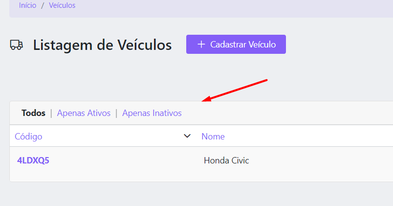
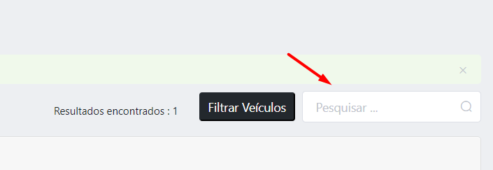
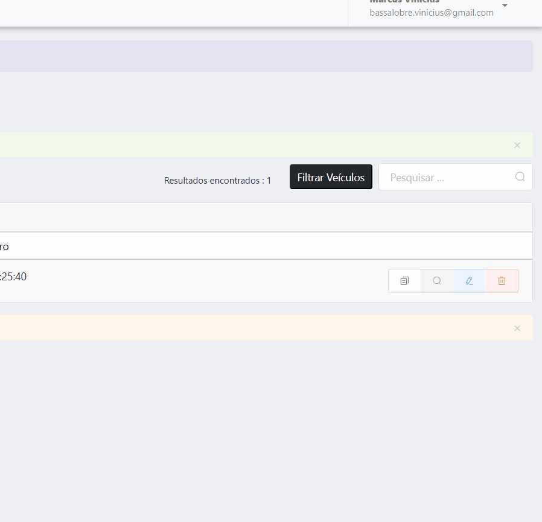

# Vstack Resources


 
Chamamos de resource o arquivo de configuração de crud.
<br>
Nela podemos definir TUDO do crud em questão, desde ícones e títulos, até métodos de gravação e comportamento pré-listagem ou exportação de relatório.
<br>
<br>

### Criando um  Resource

Para criar um novo resource, você precisa executar o comando especificando o do resource, model e tabela, respectivamente.<br> 

```
php artisan vstack:make-resource {resource} {model} {table}
```
Lembrando que este comando também criará o model, então caso o model já exista, faça um backup pois o antigo será subscrito.

[Leia mais sobre Vstack Models](MODELS.md)


Acessando <b>/admin/nome-do-resource</b>, você já verá uma crud funcional, porém pouco detalhado.

<br>
### Customizando seu Resource
Inicialmente, com o comando citado o resource ( funcional ) criado fica como no exemplo abaixo.
<br>
<br>

```
<?php

//COMANDO EXECUTADO : php artisan vstack:make-resource Carros Car cars

namespace App\Http\Resources;
use marcusvbda\vstack\Resource;

class Carros extends Resource
{
    public $model = \App\Http\Models\Car::class;
}
```
Nas imagens abaixo podemos ver como o crud e tela de listagem ficam inicialmente, veremos agora que com pouca customização deixamos de ser um crud simples pra algo mais avançado.


Adicionando seguintes métodos já daremos uma nova cara a listagem do resource
```
public function label()
{
    return "Veículos";
}

public function singularLabel()
{
    return "Veículo";
}

// https://element.eleme.io/#/en-US/component/icon#icon
public function icon()
{
    return "el-icon-truck";
}

public function nothingStoredText()
{
    return "<h4>Nenhum {$this->singularLabel()} cadastrado ainda ...</h4>";
}

public function nothingStoredSubText()
{
    return "<span>Clique em cadastrar e efetue o primeiro cadastro !!!</span>";
}

public function storeButtonlabel()
{
    return "<span class='el-icon-plus mr-2'></span>Cadastrar {$this->singularLabel()}";
}
```


Podemos também configurar as permissões deste resource utilizando os métodos "CAN",
são eles 

- <b>canViewList</b> (define se o usuário pode visualizar a listagem);
- <b>canView</b> (define se o usuário pode acessar as telas de visualização de item);
- <b>canCreate</b> (define se o usuário pode cadastrar itens);
- <b>canUpdate</b> (define se o usuário pode editar items);
- <b>canDelete</b> (define se o usuário pode excluir itens);
- <b>canDelete</b> (define se o usuário pode excluir itens);
- <b>canClone</b> (define se o usuário pode clonar itens);
- <b>canImport</b> (define se o usuário acessar o recurso de importação de planilha);
- <b>canViewReport</b> (define se o usuário acessar a listagem em modo de relátorio);
- <b>canExport</b> (define se o usuário exportar o relatório em forma de planilha excel);

Também é possivel configurar para row específico utilizando
- <b>canUpdateRow($item)</b> (define se o usuário pode editar o $item especifico);
- <b>canDeleteRow($item)</b> (define se o usuário pode excluir o $item especifico);
- <b>canCloneRow($item)</b> (define se o usuário pode clonar o $item especifico);
- <b>canViewRow($item)</b> (define se o usuário pode acessar as telas de visualização do item especifico);


Abaixo exemplo de como podemos definir as permissões de ação e ação por item para o usuário logado.

Lembrado que a rotina que definirá a resposta dessa verificação está sujeita a regra de negócio da aplicação;

```
public function canUpdate()
{
    return Auth::user()->hasPermissionTo('create');
}
public function canUpdateRow($item)
{
    return Auth::user()->hasPermissionTo('create') && !$item->permanent;
}
```
<br>
<br>

### Definindo os inputs da tela de cadastro/edição

Adicionando poucos campos ao método fields, podemos customizar nossa tela de cadastro/edição.

Exemplo abaixo :
```
public function fields()
{
    $cards = [
        new Card("Informações", [
            new Text([
                "label" => "Nome",
                "field" => "name",
                "description" => "Nome do veículo",
                "rules" => ["max:255", "required"],
            ]),
            new TextArea([
                "label" => "Observação",
                "field" => "obs",
                "show_value_length" => true,
                "rules" => ["max:255", "required"],
            ])
        ])
    ];
    return $cards;
}
```
Note que foi adicionado os campos na estrutura <b>card -> fields</b> e podemos adicionar multiplos cards
```
- CARD
--- FIELD
--- FIELD
- CARD
--- FIELD
--- FIELD
--- FIELD
--- FIELD
--- FIELD
- CARD
--- FIELD
--- FIELD
--- FIELD
...
```
Para saber mais sobre todos os inputs disponíveis e suas configurações 
[Leia mais sobre Vstack Inputs](INPUTS.md)

Outro de detalhe que podemos customizar é o método de gravação do sistema. Podemos substitui-lo completamente ou apenas adicionar algum processo ou validação extra antes ou depois do store, como no exemplo abaixo;

```
public function storeMethod($id, $data)
{
    $result = parent::storeMethod($id, $data);
    // exemplo de rotina extra
    Notifications::sendEmailNotification("Novo veículo cadastrado", "Novo carrado cadastrado");
    // exemplo de rotina extra
    return $result;
}

```

O mesmo pode-se fazer com o método <b>destroyMethod</b>, para exclusão no caso.

<br>
<br>
<br>

### Definindo as colunas da tabela de listagem

Em resources que não possui nenhum item cadastrado recebemos apenas uma mensagem dizendo que nada ainda está cadastrado e devemos clicar para adicionar o primeiro registro.

Em caso de resource que possui itens, uma listagem aparece, que por padrão é mostrado apenas o id e o campo de ações, como na imagem abaixo :


Podemos configurar quais colunas deve ser mostrada e configura-las utilizando o método <b>table</b>, como no exemplo abaixo.

```
public function table()
{
    return [
        "code" => ["label" => "Código", "sortable_index" => "id"],
        "name" => ["label" => "Nome"],
        "created_at" => ["label" => "Data de Cadastro", "sortable" => false, "handler" => function ($row) {
            return $row->created_at->format("d/m/Y H:i:s");
        }]
    ];
}
```

Note que foram adicionados 3 colunas, sendo elas :
-  <b>code</b>, trará do model o valor de <b>code</b> e será nomeada com <b>Código</b> e ao clicado para ordernar será ordernado pela coluna <b>id</b> da tabela;
-  <b>name</b>, trará do model o valor de <b>name</b> e será nomeada com <b>Nome</b> e mais nada foi definido, então neste caso, o sortable default é <b>true</b> e o sortable_index default será considerado o índice da coluna, <b>name</b> no caso;
-  <b>created_at</b>, que traria do model o valor de <b>created_at</b>, porém como definimos um handler, o resultado deste método que será o valor mostrado ( no caso formatamos a data ), será nomeada com <b>Data de Cadastro</b> e sortable foi definido como <b>false</b>, isso significa que não será possivel ordernar a tabela por está coluna;

Podemos também ao invés de utilizar o handler, criar um append pro model e chama-lo no index

por exemplo no caso da coluna created_at:

```
"formated_created_at" => ["label" => "Data de Cadastro", "sortable" => false]
```

considerando que temos um append chamado <b>formated_created_at</b> no model <b>Car</b>
<br>

Após a customização exemplificada a listagem ficou assim :


Note que o títula das colunas que podem ser ordenadas (Código e Nome) são links diferente das demais que são apenas textos não clicáveis.

<br>
<br>


### Definindo lentes de listagens
Lentes são filtros pré-definidos que incrementarão ainda mais sua listagem de resource, basta adicionar o método <b>lenses</b> ao resource como no exemplo abaixo :

```
public function lenses()
{
    return [
        "Apenas Ativos" => ["field" => "active", "value" => true],
        // "Apenas Inativos" => ["field" => "active", "value" => false],
        "Apenas Inativos" => ["field" => "active", "value" => false, "handler" => function ($q) {
            return $q->where("active", false);
        }],
    ];
}
```

Note que definimos o índice da lente como <b>Apenas Ativos</b> e <b>Apenas Inativos</b> e configuramos os seguintes parâmetros : 
- <b>field</b>, nome do campo na url;
- <b>value</b>, valor do campo na url;
- <b>handler</b>, oque fazer caso esta lente seja selecionada ( caso não definido o sistema automáticamente considerará na query a condição  'where $field = $value');

Após configurado as lentes a listagem ficará da seguinte forma :


Note que além das lentes adicionadas, o sistema adicionou um indíce nomeado <b>Todos</b> que trará o valor de consultada padrão.

caso clicado na lente que configuramos <b>Apenas Ativos</b> a página recarregará com o query parameter active=true e adicionará a query a condição "where active = true"


caso clicado na lente que configuramos <b>Apenas Inativos</b> a página recarregará com o query parameter active=false e executará o handler ao query builder da listagem antes de completar o carregamento da página.

<br>
<br>
<br>

### Adicionando conteúdo antes ou depois da listagens

Podemos também adicionar algum conteúdo antes ou depois da tabela de listagem apenas utilizando os métodos <b>beforeListSlot</b> e <b>afterListSlot</b>, como no exemplo :

```
public function beforeListSlot()
{
    return '<el-alert
                title="success alert"
                type="success"
                center
                show-icon>
            </el-alert>';
}
public function afterListSlot()
{
    return '<el-alert
                title="warning alert"
                type="warning"
                center
                show-icon>
            </el-alert>';
}
```

No caso do exemplo, foi adicionado um html, porém podemos adicionar um texto comúm ou até renderizar uma blade da seguinte forma : 
```
return view('slots.example')->render();
```

Após a adição de conteudo nesses slots a tela ficará da seguinte forma :


Pode-se também adicionar slots como este na tela de visualização, cadastro, edição e relatório, da mesma forma apenas utilizando os métodos <b>beforeReportListSlot, beforeListSlot,  afterListSlot, beforeEditSlot, afterEditSlot, beforeCreateSlot, afterCreateSlot, beforeViewSlot, beforeViewSlot e afterViewSlot </b>


<br>
<br>
<br>

### Adicionando filtros ao seu resource

Podemos adicionar 2 tipos diferentes de filtros no seus resources, busca simples e filtros específicos.


Para configurar a busca simples, basta definir no método <b>search</b> as colunas que deseja realizar a busca, como no exemplo :

```
public function search()
{
    return ["name", "description"];
}
```


Note que assim que adicionado os indíces de busca, o campo <b>Pesquisar</b> aparecerá na listagem e o sistema adicionará a condição "where {$index} like "%{$value}%" para cada um dos índices adicionados. 

Podemos também passar um handler function ao invés de um índice, como no exemplo :

```
public function search()
{
    return ['name', function ($query, $val) {
        return $query->where("name", "like", "%{$val}%");
    }];
}
```

Neste caso o sistema fará o filtro like para a coluna <b>name</b> e executará o handler com $val sendo o valor digitado no input.

<br>
<br>

Para configurar os filtros específicos, basta definir no método <b>fielters</b> os filtros que deseja adicionar.

Temos 2 formas de fazer isso.

Com filtros mais básicos como, filtros que não exijam joins ou processamentos mais pesados, podemos utilizar os filtros pré-definidos, da seguinte forma :

```
public function filters()
{
    return [
        new FilterByName(),
        //new FilterByText([
        //    "column" => "name",
        //    "label" => "Nome"
        //]),
        new FilterByText([
            "column" => "description",
            "label" => "Descrição"
        ]),
        new FilterByPresetDate([
            "column" => "created_at",
            "label" => "Cadastrado em"
        ]),
        new FilterByOption([
            "label" => "Nível",
            "column" => "level",
            "multiple" => true,
            "options" => [
                ["value" => 1, "label" => '⭐'],
                ["value" => 2, "label" => '⭐⭐'],
                ["value" => 3, "label" => '⭐⭐⭐'],
                ["value" => 4, "label" => '⭐⭐⭐⭐'],
                ["value" => 5, "label" => '⭐⭐⭐⭐⭐'],
            ]
        ]),
    ];
}
```


Para filtros mais complexos você pode executar o comando <b>php artisan vstack:make-filter {resource} {name} {type}</b>

que será criado uma classe em /Http/Filters/NOME_DO_RESOURCE/NOME_DO_FILTER.php nos padrões abaixo :

```
<?php 
// COMANDO EXECUTADO : php artisan vstack:make-filter Carros FilterByName text-filter
namespace App\Http\Filters\Carros;
use  marcusvbda\vstack\Filter;

class FilterByName extends Filter
{
    
    public $component   = "text-filter";
    public $label       = "FilterByName";
    public $placeholder = "";
    public $index = "filter_by_name";
    
    public function apply($query, $value)
    {
        //filter logic here...
        return $query;
    }
}
```

Note que esta classe possui variáveis de configuração e um método chamado <b>apply</b>, é neste método que será executado o filtro quando chamado.

Para adiciona-lo aos filtros do resource, basta adiciona-lo em filters da seguinte forma :

```
...
//new FilterByText([
//    "column" => "name",
//    "label" => "Nome"
//]),
new FilterByName(),
...
```

Para entender melhor sobre os tipos de filtros disponíveis e exemplos mais avançados 
[Leia mais sobre Filtros](FILTERS.md)