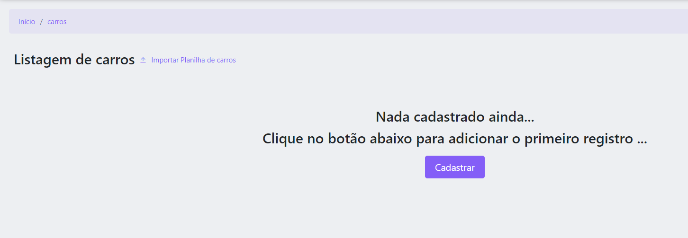
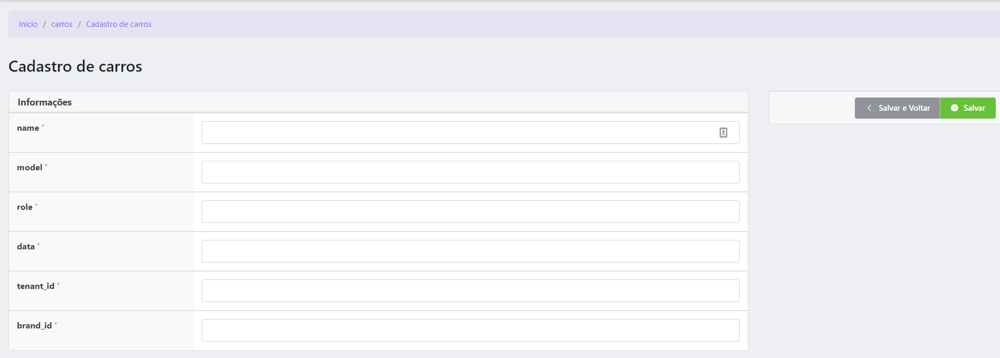
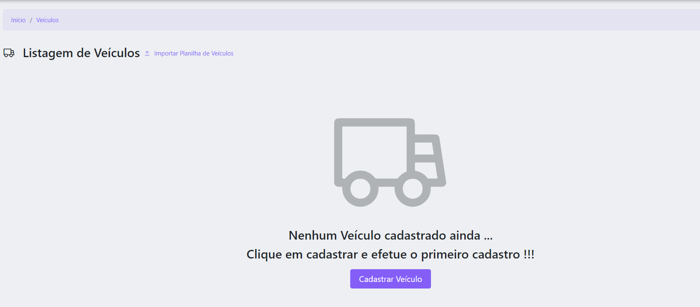

# Vstack Resources


 
Chamamos de resource o arquivo de configuração de crud.
<br>
Nela podemos definir TUDO do crud em questão, desde ícones e títulos, até métodos de gravação e comportamento pré-listagem ou exportação de relatório.
<br>
<br>

### Criando um  Resource

Para criar um novo resource, você precisa executar o comando especificando o do resource, model e tabela, respectivamente.<br> 

```
php artisan vstack:make-resource {resource} {model} {table}
```
Lembrando que este comando também criará o model, então caso o model já exista, faça um backup pois o antigo será subscrito.

[Leia mais sobre Vstack Models](MODELS.md)


Acessando /admin/{nome-do-resource}, você já verá uma crud funcional, porém pouco detalhado.

<br>
### Customizando seu Resource
Inicialmente, com o comando citado o resource ( funcional ) criado fica como no exemplo abaixo.
<br>
<br>

```
<?php

//COMANDO EXECUTADO : php artisan vstack:make-resource Carros Car cars

namespace App\Http\Resources;
use marcusvbda\vstack\Resource;

class Carros extends Resource
{
    public $model = \App\Http\Models\Car::class;
}
```
Nas imagens abaixo podemos ver como o crud e tela de listagem ficam inicialmente, veremos agora que com pouca customização deixamos de ser um crud simples pra algo mais avançado.




Adicionando seguintes métodos já daremos uma nova cara a listagem do resource
```
public function label()
{
    return "Veículos";
}

public function singularLabel()
{
    return "Veículo";
}

// https://element.eleme.io/#/en-US/component/icon#icon
public function icon()
{
    return "el-icon-truck";
}

public function nothingStoredText()
{
    return "<h4>Nenhum {$this->singularLabel()} cadastrado ainda ...</h4>";
}

public function nothingStoredSubText()
{
    return "<span>Clique em cadastrar e efetue o primeiro cadastro !!!</span>";
}

public function storeButtonlabel()
{
    return "<span class='el-icon-plus mr-2'></span>Cadastrar {$this->singularLabel()}";
}
```



Podemos também configurar as permissões deste resource utilizando os métodos "CAN",
são eles 

- canViewList:Boolean (define se o usuário pode visualizar a listagem);
- canView:Boolean (define se o usuário pode acessar as telas de visualização de item);
- canCreate:Boolean (define se o usuário pode cadastrar itens);
- canUpdate:Boolean (define se o usuário pode editar items);
- canDelete:Boolean (define se o usuário pode excluir itens);
- canDelete:Boolean (define se o usuário pode excluir itens);
- canClone:Boolean (define se o usuário pode clonar itens);
- canImport:Boolean (define se o usuário acessar o recurso de importação de planilha);
- canViewReport:Boolean (define se o usuário acessar a listagem em modo de relátorio);
- canExport:Boolean (define se o usuário exportar o relatório em forma de planilha excel);

Também é possivel configurar para row específico utilizando
- canUpdateRow($item):Boolean (define se o usuário pode editar o $item especifico);
- canDeleteRow($item):Boolean (define se o usuário pode excluir o $item especifico);
- canCloneRow($item):Boolean (define se o usuário pode clonar o $item especifico);
- canViewRow($item):Boolean (define se o usuário pode acessar as telas de visualização do item especifico);


Abaixo exemplo de como podemos definir as permissões de ação e ação por item para o usuário logado.

Lembrado que a rotina que definirá a resposta dessa verificação está sujeita a regra de negócio da aplicação;

```
public function canUpdate()
{
    return Auth::user()->hasPermissionTo('create');
}
public function canUpdateRow($item)
{
    return Auth::user()->hasPermissionTo('create') && !$item->permanent;
}
```
<br>
<br>

### Definindo os inputs da tela de cadastro/edição
[Leia mais sobre Vstack Inputs](INPUTS.md)

Adicionando poucos campos ao método fields, podemos customizar nossa tela de cadastro/edição.

Exemplo abaixo :
```
public function fields()
{
    $cards = [
        new Card("Informações", [
            new Text([
                "label" => "Nome",
                "field" => "name",
                "description" => "Nome do veículo",
                "rules" => ["max:255", "required"],
            ]),
            new TextArea([
                "label" => "Observação",
                "field" => "obs",
                "show_value_length" => true,
                "rules" => ["max:255", "required"],
            ])
        ])
    ];
    return $cards;
}
```
Note que foi adicionado os campos na estrutura card -> fields e podemos adicionar multiplos cards
```
- CARD
--- FIELD
--- FIELD
- CARD
--- FIELD
--- FIELD
--- FIELD
--- FIELD
--- FIELD
- CARD
--- FIELD
--- FIELD
--- FIELD
...
```